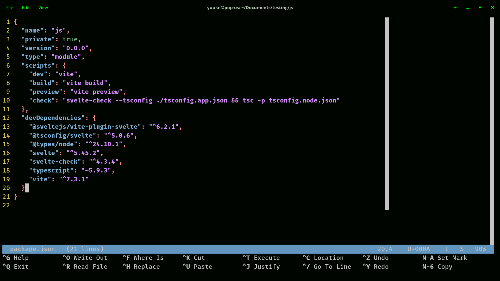
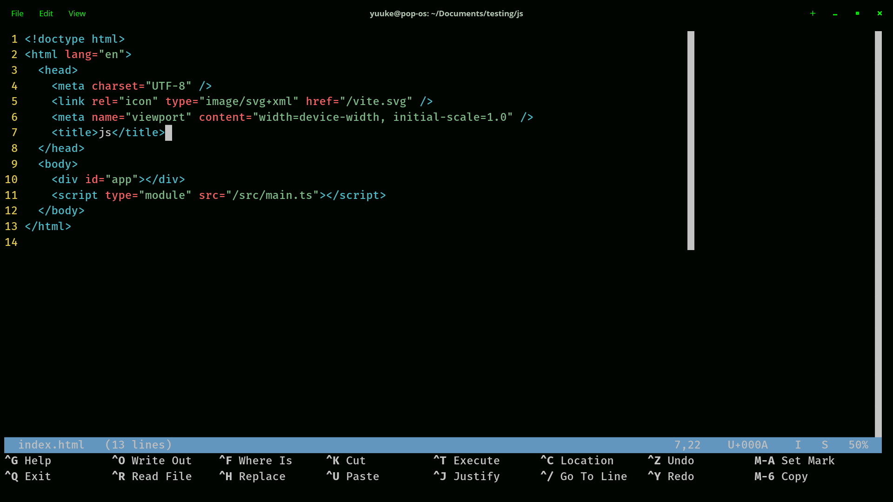
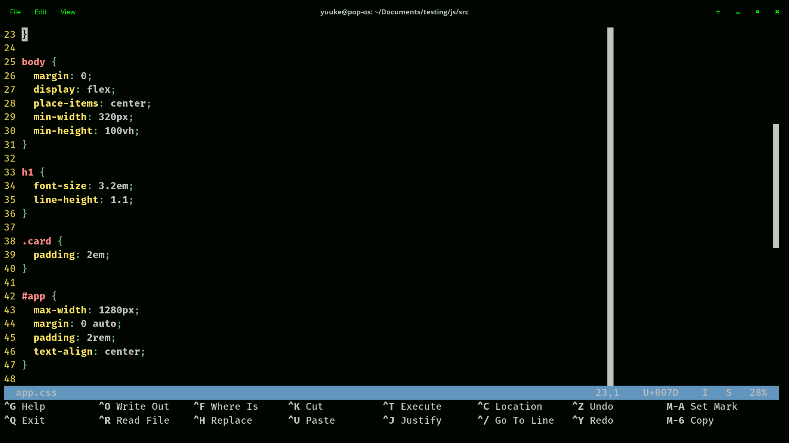
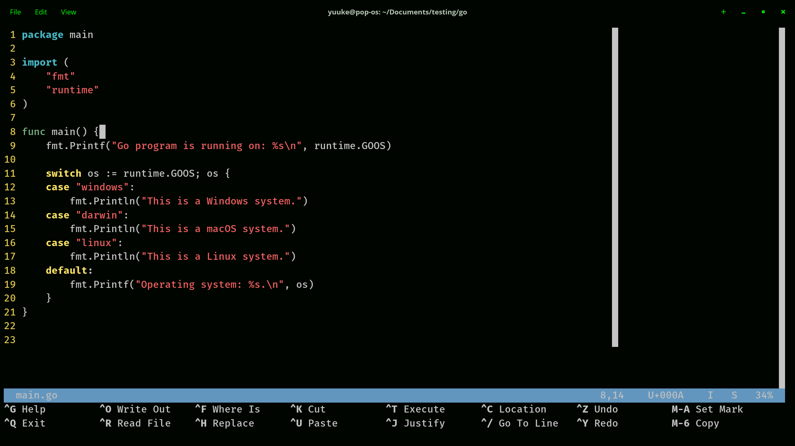

# Nano Config

## What is This?

This is my personal nano text editor customize.

In my case I often check file using nano and in the time I feel bored look at the nano editor it's feel so boring

So I customize nano for my personal use, add color highligting, minimap, cutom key bindi    ng, etc

## How To Use

To use this config create file .nanorc in your home directory "~/.nanorc" and put this code

Or just copy file .nanorc in this repo and put in the your home directory

## Key Binding

For key binding I cutom some key that I familiar with it

* Ctrl+S for save you can see in `bind ^S savefile main`
* Ctrl+F for search you can see in `bind ^F whereis main`
* Ctrl+Z for undo you can see in `bind ^Z undo main`
* Ctrl+Y for rendo you can see in `bind ^Y redo main`
* Ctrl+Q for exit nano you can see in `bind ^Q exit all`
* Ctrl+H for replace text you can see in `bind ^H replace main`

## Screenshot

### Json

### HTML

### CSS

### Go

